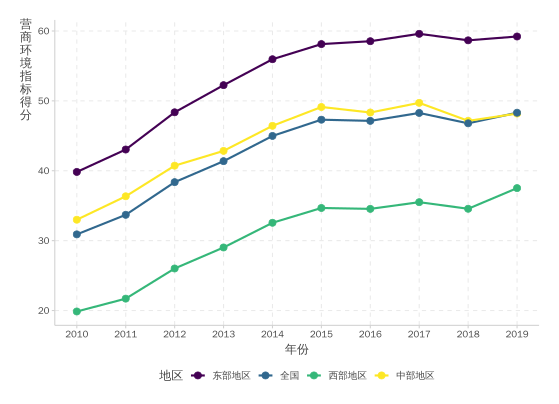
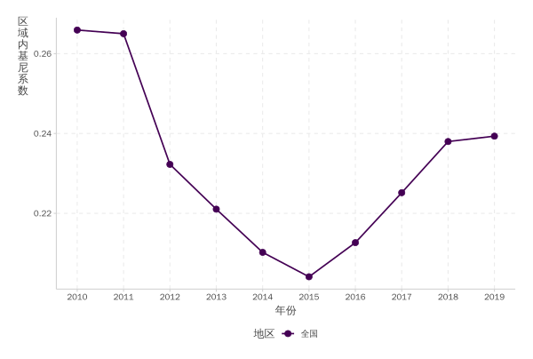
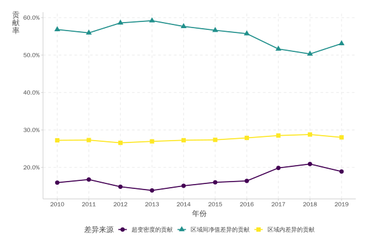

---
title: "中国营商环境的地区差异与时空演变研究"
  
author: 
  - "张沐"
  - "程烺"
date: '`r Sys.Date()`'
institute: "<br> 华中师范大学<br>经济与工商管理学院"
output:
  xaringan::moon_reader:
    css: xaringan-themer.css
    nature:
      highlightStyle: github
      highlightLines: true
      ratio: 16:9
      countdown: 60000
      navigation :
        click: false 
        scroll: false
      countIncrementalSlides: true
---

```{r setup, include=FALSE}
library(xaringanExtra)
library(xaringanthemer)

library(xaringanthemer)
library(xaringanthemer)
xaringanExtra::use_editable()
xaringanExtra::use_panelset()
xaringanExtra::use_clipboard()
xaringanExtra::use_tile_view()
xaringanExtra::use_tachyons()
xaringanExtra::use_share_again()
xaringanExtra::use_xaringan_extra()
xaringanExtra::use_search(show_icon = TRUE)
xaringanExtra::use_extra_styles(hover_code_line = T,mute_unhighlighted_code = T)

xaringanExtra::use_logo(image_url = "https://www.ccnu.edu.cn/__local/7/B7/24/0EA1E510D6F171BBEA51CFF88E8_A12ECAAB_5EDF.jpg",
link_url = "https://www.ccnu.edu.cn/",
position = xaringanExtra::css_position(top = "0.3em", right = "0.3em"),
width = "100px",height ="100px")


xaringanthemer::style_duo_accent(
  primary_color = "#1B7386",
  secondary_color = alpha("white"),
  code_font_family = "Menlo",
  code_inline_color = alpha("gold",0.8),
  text_slide_number_color = alpha("firebrick"),
  code_font_size = "15px",base_font_size = "16px"
  )
```


```{r xaringan-logo,echo = F}
xaringanExtra::use_logo(
  image_url = "https://www.ccnu.edu.cn/__local/7/B7/24/0EA1E510D6F171BBEA51CFF88E8_A12ECAAB_5EDF.jpg",
  link_url = "https://www.ccnu.edu.cn/",
  position = xaringanExtra::css_position(top = "0.3em", right = "1em"),
  width = "100px",height ="100px" 
)
```


<style>
  .title {
    border-radius:9px;
    border-bottom: 4mm ridge #FF6978;
  }
</style>


# 技术路线与本文框架

.panelset[


.panel[.panel-name[技术路线]

<br>

```{r echo=FALSE,fig.align='center'}

```


]

.panel[.panel-name[本文框架]

- 引言

- 文献综述


- 实证方法

- 实证结果1：地区差异

- 实证结果2：时变趋势

- 实证结果3：收敛机制

- 实证结果4：空间集聚性

- 结论与政策建议

]


]


---

# 引言


```{r echo=F}
xaringanExtra::style_panelset_tabs(
  active_foreground = "#0051BA",
  hover_foreground = "#d22"
)
```

1978 年以来，中国的改革开放取得了举世瞩目成就，为广大发展中国家提供了堪 称典范的“中国经验”。在改革开放的前 30 年，招商引资的确为我国经济的快速增长 提供了积极贡献。然而，在经济进入高质量发展阶段后，通过低廉的要素供给价格、 突破底线的政策支持和对破坏生态的默许等“优惠”条件，来吸引外资入驻，以期高 速增长速度的发展模式显得日渐式微。

以招商引资为代表的政府履行经济发展职能的方式本质上是政府越位和错位的表现（黎民、刘玉娟 2004），往往会导致公共权利的滥用、官员目标函数变异和企业与政府间的“双向寻租”（王洛忠、刘金发 2007）。 

因此，为近一步释放经济增长潜能，提升地方政府治理体系和治理能力现代化，政府 应从招商引资的“主导人”向优化营商环境的“服务者”这一角色转变，学习“造环 境”的新本领（宋林霖 2018）。党的十九届五中全会提出，要全面深化转变政府职能 等各领域改革，优化营商环境，大力推动科技创新，更大激发各类市场主体活力和人 民群众创造力。好的营商环境就是生产力，营商环境只有更好，没有最好。

在“十三五”期间，我国的营商环境有了长足的进步，根据世行发布的《2020 年营商环境报告》，中国排名跃居第 31 位，连续两年被评为“年度十大最佳改革者”。但是也要意识到，世行的评价指标仅局限于营商便利化的方面，而忽略了例如法治保障、经济稳定、公共服务等其他因素，并且此次排名中代表中国的样本均来自于中国最发达的两个城市——北京和上海，因此并不能客观且全面地代表中国整体营商环境的进步速度。


---
# 文献综述


.pull-left[
```{r echo=FALSE,fig.align='center',out.width="80%"}

```

]

.pull-right[
纵观已有文献发现，我国对于营商环境的相关研究近几年已经积累了一定的成果，但存在一定的局限性。本文认为对于营商环境的研究还可从以下两方面进行拓展:

- 首先，现有文献在进行营商环境评价体系构建时把握住了“国际可比、对标世行”，而忽视了<span style='color:red'>“中国特色”</span>的原则，导致在进行测度指标选取时对照世行的已有标准削足适履，且测度数据往往是基于特定年份或特定地区的相关报告，无法构成一个连贯且全面的面板数据，因此也无法针对中国的营商环境问题进行全面系统的考察；

- 其次，鲜有文献基于<span style='color:red'>区域协调发展</span>的角度，深入探讨营商环境的问题。在新常态背景下，经济增长已经从“量”上高速增长转为“质”上的高质量增长，对于中国而言，企业发展面临的复杂经济、市场及制度环境存在明显的地域差异（黎常 2014；张三保 2020），而营商环境的发展程度与区域经济发展之间存在相互促进的互动关系，区域营商环境的发展程度及其分布状态直接影响着区域核心竞争力以及区域经济的转型发展。

]


---
# 实证方法


.panelset[


.panel[.panel-name[1、指标体系构建]

#### 现有文献的做法与弊端：
营商环境是一系列和企业经营环境相关因素的综合，因此营商环境的评价体系必须是由多方面、多指标所构成的。目前关于营商环境评价体系的构建方法主要为：效用值法（李志军 2019；张三保 2019）、加权平均（阮舟一龙 2020；张三保 2020）、解释结构模型法（陈强 2021）。但这3种数据降维方法，都无法避免各个基础指标之间可能存在的相关性，从而可能导致结果存在权重结构性问题（吕承超 2020）。除此之外，三类方法所确定的权重来自于人为的主观判断，导致研究的可重复性下降。

#### 本文的做法与具体步骤：
基于此，为尽可能的保留原始数据所含信息以及权重选取的客观性，本文使用<span style='color:red'>主成分分析法（PCA）</span>来确定基础指标在一级指标中所占权重，并采用相同的方法合成营商环境综合指标，对2010年至2019年中国省份的营商环境发展情况进行评价。

参照钞小静（2011）和吕承超（2020）的做法，具体操作步骤为：第一，对指标属性为负的数据取倒数进行正向化处理，以保证正、负指标作用力同向；第二，对测度数据进行均值化处理，以消除纲量的差异；第三，对全部面板数据使用协方差输入主成分分析法，以保留指标间的相对离散特征；第四，使用第一主成分分析法来确定权重，由此得到目标指标的结果；第五，对结果进行归一化处理，转化为百分制的得分形式，以方便与已有文献的结果进行对照。


]

.panel[.panel-name[2、地区差异]


.pull-left[

#### 各种不平等测度方法的优劣：
在衡量地区差异中总常用的统计指标是基尼系数，而随着统计学的发展，在传统基尼系数的基础之上逐渐又演化出<span style='color:red'>泰尔指数</span>（1967）、<span style='color:red'>Pyatt基尼系数</span>（1967）和<span style='color:red'>Dagum基尼系数</span>（1997）等一系列不平等的统计方法。

- 传统基尼系数只能比较各个地区的整体不平等程度，不能近一步揭示不平等的来源和特征，并且在研究对象是空间非均衡时得到结果的准确性往往会受到质疑。

- 泰尔指数虽然在传统基尼系数的基础之上将区域间的总体差异近一步分解为组内差异和组间差异两部分，但是要求不同组别的样本应满足独立同方差和正态分布，而在实际中这一点往往难以满足。

- Pyatt基尼系数则将基尼系数近一步分解为三个部分：区域内差异、区域间差异和层迭项（overlapped），但是由于计算过程的繁杂因而其主要贡献体现在理论证明上。

- Dagum基尼系数则在上述方法的基础之上，不仅可以有效克服基尼系数不能按子群进行分组测算的局限，同时还能定量得到不同子群对地区差距的各自贡献程度以及解决样本交叉重叠的问题。


]


.pull-right[

#### Dagum基尼系数分解的基本思想：


```{r echo=FALSE}

```
]


]

.panel[.panel-name[3、时变趋势]

#### 研究的必要：
虽然Dagum基尼系数可通过对营商环境指标的区域差异进行分解而得到描述差异特征和来源的具体数值，但是并不能对营商环境指标的分布曲线进行可视化分析，为了近一步研究中国营商环境指标分布形态和动态演进特征，本文近一步使用核密度估计曲线（KDE）来展开实证研究。

#### 现有研究方法的优劣：
目前，对于区域指标的动态分布演进的实证方法主要为马尔科夫链法和核密度估计法。

- 马尔科夫链法的使用往往要满足两个前提假定。第一，一阶马尔科夫链（First-order Markov Chain），即指标未来的演变状态仅受当前状态的影响，而不受过去历史的影响；第二，时间同质性（Time Homogeneity），即在样本考察期内，马尔科夫转移矩阵是时不变的。

- 核密度估计法则并不需要对分布的形式作出事先假定，而是基于数据的自身信息使用连续密度曲线对随机变量的概率密度进行估计。但是核密度的估计对带宽的选择相当敏感，因此带宽选择的合适与否便直接影响到最后估计结果的精确性。

#### 本文所选方法：

为解决上述问题，本文使用自适应带宽核密度法（Adaptive Bandwidth Kernel Density Method），其基本思想是先对密度进行逐点估计，得到一组针对个体观测值的局部带宽系数，然后基于这组数据构建自适应带宽，从而实现了带宽随着样本的位置而变化。也即自适应带宽核密度法是基于固定带宽核密度函数的基础上，通过修正带宽参数而得到的。
]

.panel[.panel-name[4、收敛机制]
对于经济指标收敛性的研究根据其研究视角的不同，可分为时间视角和空间视角两类，分别对应时间收敛和空间收敛。

- 时间收敛是指随着时间的推移，初始存在差距的两个个体间的差距会逐渐缩小；

- 而空间收敛则是指处于外围空间的个体，其经济指标具有趋向于中心个体的特征。

对于时间收敛，常见的模型有    $\sigma$  收敛模型、绝对    $\beta$ 收敛模型、条件    $\beta$ 收敛模型和俱乐部收敛模型。而对于对于空间收敛的分析，常见的模型有加入空间矩阵的拓展    $\beta$ 收敛模型：空间误差模型（SEM）、空间杜宾模型（SBM）等。本文对于营商环境指标收敛性研究中重点关注其时间收敛性，因此使用基本的    $\sigma$  收敛模型和基于    $\beta$ 收敛模型的拓展模型——边际垂直    $\beta$ 收敛（Marginal Vertical $\beta$-convergence ）模型。


.pull-left[

#### $\sigma$  收敛：
  $\sigma$  收敛是指随着时间的推移不同地区的营商环境指标偏离整体平均的差异呈现出逐渐减小的趋势，其常见的测度指标有`变异系数`、`基尼系数`和`泰尔指数`等。参照大多数文献的做法，本文使用变异系数来测度营商环境指标均等化的    $\sigma$  收敛：

\begin{equation}
\sigma_{t}=\frac{\sqrt{\frac{1}{n} \sum_{i=1}^{n}\left(Index_{i t}-\frac{1}{n} \sum_{i=1}^{n} Index_{i t}\right)^{2}}} { \frac{1}{n} \sum_{i=1}^{n} Index_{i t}} 
\end{equation}

其中，    $Index_{it}$  为    $t$ 年第    $i$ 个省份的营商环境得分。若    $\sigma_t$  随时间的推移而减小，则说明各省份的营商环境指标差距在不断减小，具有向均值收敛的趋势。
]


.pull-right[

#### 传统 $\beta$ 收敛模型：

\begin{equation}
log \left(\frac{y_{i,t+1}}{y_{i t}}\right)= \alpha_0+\alpha_1 log \left(y_{i t}\right)+\lambda_i+\eta_t+\mu_{it} \tag{17}
\end{equation}

#### 边际垂直   $\beta$ 收敛模型：

边际垂直收敛的核心思想是计算出单个个体对于整体收敛过程中的贡献。这一思想最早来自于微观经济学中投对于资组合风险的计算，某一个单个资产的风险可以理解为全资产投资组合的风险减去除去这个资产外N-1个资产的风险（Hozer 2004）。
]]

.panel[.panel-name[5、空间集聚性]
经济指标的空间相互作用可分为两类，第一类是空间依赖性（也称为空间自相关），其表示空间上的观测值之间缺乏独立性，空间相关的强度和模式由空间的绝对位置和相对位置一起决定；第二类是空间异质性（也称为空间差异性），其表示地理空间上的地区缺乏均质性，存在中心和外围地区、发达和落后地区等经济地理结构。


.pull-left[

#### 全局Moran’s I指数

\begin{equation}
\text { Moran's I }==\frac{\sum_{i=1}^{n} \sum_{j=1}^{n} w_{i j}\left(x_{i}-\bar{x}\right)\left(x_{i}-\bar{x}\right)}{S^{2} \sum_{i=1}^{n} \sum_{j=1}^{n} w_{i j}} \tag{22}
\end{equation}


其中，    $S^2 = \frac{1}{n}\sum_{i=1}^n(x_i-\bar x)^2$  ，   $\bar x = \frac{1}{n}\sum_{i=1}^{n}x_i$ ，    $n$ 为空间单元个数，    $x_i$ 表示第    $i$ 个空间单元的观测值，    $w_{ij}$  为空间权重矩阵，本文选择两地区距离平方的倒数的空间权重矩阵（30*30阶）。

]


.pull-right[

#### 局部Moran’s I指数（LISA）

\begin{equation}
LISA=\frac{\left(x_{i}-\bar{x}\right)}{S^{2} \sum_{j \neq 1}^{n} w_{i j}\left(x_{j}-\bar{x}\right)} \tag{23}
\end{equation}


Moran’s I指数散点图能更加直观地刻画局域空间相关性。其中，x轴为    $z = x_i-x$  ，表示空间滞后因子；y轴为   $w_z$ 为空间权重矩阵。

]


]


]

---
# 基本事实

.panelset[


.panel[.panel-name[1、营商环境子系统变化趋势]

```{r echo=FALSE,fig.align='center',out.width="60%"}

```


]

.panel[.panel-name[2、营商环境综合指标变化趋势]


```{r echo=FALSE,fig.align='center',out.width="60%"}



```


.panel[.panel-name[3、营商环境综合指标空间分布情况]

```{r echo=FALSE,fig.align='center',out.width="60%"}


```

]]
]


---
# 实证结果1：地区差异


.panelset[

.panel[.panel-name[总体差异]

```{r echo=FALSE,fig.align='center',out.width="60%"}

```


]


.panel[.panel-name[区域内差异]

```{r echo=FALSE,fig.align='center',out.width="60%"}

```


]


.panel[.panel-name[区域间差异]

```{r echo=FALSE,fig.align='center',out.width="60%"}

```


]

.panel[.panel-name[差异的来源与贡献]

```{r echo=FALSE,fig.align='center',out.width="60%"}

```


]

]


---
# 实证结果2：时变趋势


.panelset[

.panel[.panel-name[全国层面]

```{r echo=FALSE,fig.align='center',out.width="60%"}

```

]

.panel[.panel-name[三大区域层面]

```{r echo=FALSE,fig.align='center',out.width="60%"}

```


]


]


---
# 实证结果3：收敛机制


.panelset[

.panel[.panel-name[sigma收敛]

```{r echo=FALSE,fig.align='center',out.width="60%"}

```


]

.panel[.panel-name[beta收敛]

.pull-left[

大多数的实证文献都假设由式（17）所得的估计系数应该在观测期内是稳定的。Grela（2017）指出验证这种稳定性的做法主要有三种：

1. 依照实际经济意义，将全样本分为多个时间跨度不相重叠的子区间；

2. 选取一个固定的时间跨度，对全样本进行滚窗划分；

3. 忽视面板数据的时间维度，将全样本进行逐年回归。

参考现有文献，本文采用第一种做法，将2010年至2019年的全样本以2014年作为分界点，划分为两个子样本。这样做的原因处于以下两点：首先，2014年是中国经济的一个转型年，在这一年正式提出了“经济新常态”的概念，标志着我国经济发展在速度、结构和动力上的转变；其次，将样本分割为2010年至2014年和2015年至2019年，可使两个子区间的年度跨期比较均匀，从为尽可能的减少由于样本数量而造成的差异。

]

.pull-right[

```{r echo=FALSE,fig.align='center'}
knitr::include_graphics("pic/10.jpg")
```

]


]

.panel[.panel-name[近一步分析：边际垂直beta收敛]


.pull-left[

```{r echo=FALSE,fig.align='center'}

```

]


.pull-right[

```{r echo=FALSE,fig.align='center'}

```

]


]

]

---
# 实证结果4：空间集聚性


.panelset[

.panel[.panel-name[全局Moran’s I指数]

```{r echo=FALSE,fig.align='center',out.width="60%"}
knitr::include_graphics("pic/12.svg")
```

]

.panel[.panel-name[局部Moran’s I指数（LISA）]

```{r echo=FALSE,fig.align='center',out.width="60%"}

```


]


]

---
# 结论


- 第一，从基本事实特征来看。

- 第二，从地区差异来看。

- 第三，从动态分布演进特征来看。

- 第四，从收敛机制来看。

- 最后，从空间集聚性来看。


---
class:center inverse

# 感谢您的聆听！
### <span style='color:steelblue'>敬请批评指正</span>


```{r, echo=FALSE, fig.align='center', out.width='55%'}
knitr::include_graphics("pic/logo.jpg")
```


